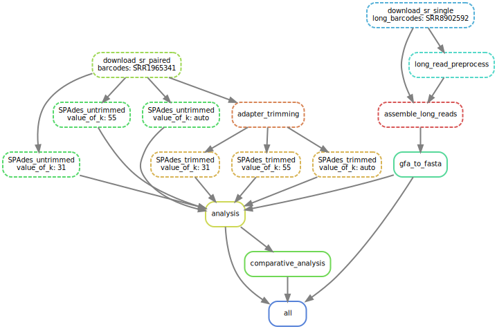
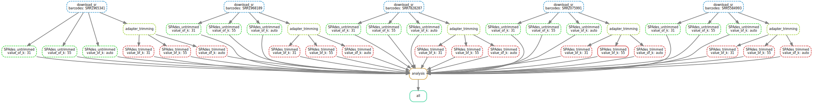

## A genomics pipeline with snakemake



>Your boss is looking for a motivated student to do some reproducible data analysis on a few
>Salmonella enterica genomes they sequenced recently.

[TOC]

### Salmonella: a brief introduction
Salmonella enterica are Gram-negative, facultative anaerobic, flagellate bacteria.  
Some of it serovars are human pathogens.  
In humans, Salmonella are the cause of two diseases called salmonellosis: enteric fever (typhoid), resulting from bacterial invasion of the bloodstream, and acute gastroenteritis, resulting from a foodborne infection/intoxication.  
(Todar, Kenneth. ["Salmonella and Salmonellosis"](http://www.textbookofbacteriology.net/salmonella.html). Todar's Online Textbook of Bacteriology.) 


#### Setup:
```
conda env create -n salmonella -f tools/final.yml
conda activate salmonella
```
This will install all the packages used, so no need to follow the Diary for installation
#### Usage Instructions
```
snakemake --cores 4
```

#### Results
The results can be found in the "data/" and the "plots/" folder.   

An Analysis report is being created automatically and can be found [here](data/Analysis.md).

<iframe src="installed_list.txt"></iframe>    
  
    
    
#### Creation Diary
- setup a conda environment from yml file
```
conda env create -n salmonella -f tools/environment.yml
conda activate salmonella
```
- created a folder structure and README
- Read about sra-tools [here](https://eaton-lab.org/articles/sra-downloads/) -> tool fastq-dump for downloading fastq files
- Read about SPAdes [here] (https://github.com/ablab/spades)
- State of tools and version at this time [here](https://gitlab.rlp.net/bioinformatik-praktikum-sose21/MLink/salmonella-enterica-pipeline/-/blob/main/tools/tools-state-after-first-tools-install)
- ran `fastq-dump --split-files SRR1965341 -O /data/short-reads/` to find out what the output files look like
- wrote first rule in Snakefile:
 ```
 rule download_sr:
    output:
        "/data/short-reads/SRR1965341_1.fastq",
        "/data/short-reads/SRR1965341_2.fastq"
    shell:
        "fastq-dump --split-files SRR1965341 -O /data/short-reads/"
```
- Expand Snakefile to allow for variable barcodes:
```
rule all:
    input:
        expand("/data/short-reads/{barcodes}_{NR}.fastq",NR=["1","2"],barcodes=["SRR1965341"])
rule download_sr:
    output:
        "/data/short-reads/{barcodes}_1.fastq",
        "/data/short-reads/{barcodes}_2.fastq"
    shell:
        "fastq-dump --split-files {wildcards.barcodes} -O /data/short-reads/"
```
- Install Graphviz to generate pretty picture
```
conda install graphviz
```
```
snakemake -n --dag | dot -Tsvg > dagsra-tools.svg
```


About sra-tools:
- fastq-dump is a tool to download fastq files from the short-reads archive
- --split-files is a parameter to save paired-ended reads into two seperate files
- SRR1965341 is the barcode given in the instructions
-  -O is a parameter to specify the output directory, which is: /data/short-reads/
- Output: two files named BARCODE_1.fastq and BARCODE_2.fastq

1 = file contains “forward” reads
2 = file contains “reverse” reads

SPAdes:
```
-1 <filename>               file with forward paired-end reads
-2 <filename>               file with reverse paired-end reads
-s <filename>               file with unpaired reads
-o <output_dir> directory to store all the resulting files (required)

```
>Contig: von continious: zusammenhängend: überlappende reads
>Scaffold are chained together contigs using additional information about position and orientation of the contigs in the genome and using gaps


Changed from fastq-dump to fasterq-dump. Fasterq-dump is the more recent tools and also separates the unpaired reads automatically (splits into 3: forward, reverse, error)
```
rule all:
    input:
        expand("/data/short-reads/{barcodes}_{NR}.fastq",NR=["1","2"],barcodes=["SRR1965341"])
rule download_sr:
    output:
        "/data/short-reads/{barcodes}_{NR}.fastq",
    shell:
        "fasterq-dump {wildcards.barcodes} -O /data/short-reads/"
```
Upgraded sra-tools to a newer version to get access to fasterq-dump
```
conda install sra-tools=2.11.0
conda install spades
```
```
screen -S Spades
```

```
snakemake --cores 6
```


Added additional barcodes to config.yaml

```
screen -S expand
conda activate salmonella
```
```
snakemake --cores 6
```
write python script statistics.py in /scripts
```
conda install matplotlib
conda install pandas
conda install seaborn
```

```
Cutadapt :
 Parameters -a, -g, -b specify adapters to be removed from each read (or from the first read in a
  pair if data is paired). If specified multiple times, only the best matching adapter is trimmed (but
  see the --times option). When the special notation 'file:FILE' is used, adapter sequences are read
  from the given FASTA file.

 -a ADAPTER, --adapter ADAPTER
                        Sequence of an adapter ligated to the 3' end (paired data: of the first read).
                        The adapter and subsequent bases are trimmed. If a '$' character is appended
                        ('anchoring'), the adapter is only found if it is a suffix of the read.
-j CORES, --cores CORES
                        Number of CPU cores to use. Use 0 to auto-detect. Default: 1
Paired-end options:
  The -A/-G/-B/-U options work like their -a/-b/-g/-u counterparts, but are applied to the second read
  in each pair.

  -A ADAPTER            3' adapter to be removed from second read in a pair.
  ```



### Long read sequencing

-According to the [sequence read archive](https://trace.ncbi.nlm.nih.gov/Traces/sra/?run=SRR8902592) the provided long reads are single ended.
- Since the already implemented rule was for downloading paired ended reads, I should write a new one

Preprocess:
> Overlap for PacBio reads (or use "-x ava-ont" for nanopore read overlapping)  
>minimap2/minimap2 -x ava-pb -t8 pb-reads.fq pb-reads.fq | gzip -1 > reads.paf.gz

```
conda install minimap2     (2.22)
conda install minimap2     (miniasm-0.3_r179)
```
Update analysis script for long reads
```
conda install biopython    (1.78)
```
Added both scripts to the pipeline so that they are automatically called.
The scripts generate an [Analysis file](data/Analysis.md).

|pipeline overview|
|---|
||

Todo:
-Logging
