#### statistics analysis for barcode: SRR1965341_untrimmed 
|N50|
|---|  
|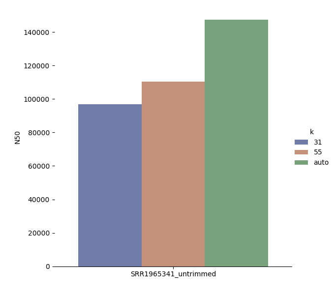|

| k  |statistics| plot   | 
|-------------------------|--------------------------|--------------------------|        
|31 |average contig length: 3363.1139410187666   total number of contigs: 1492   shortest contig: 32    longest contig: 321983   N50 of all contigs: 96827.0   N50 of all contigs over 300 bp: 103861|  |
|55| average contig length: 15548.29906542056   total number of contigs: 321   shortest contig: 56    longest contig: 322089   N50 of all contigs: 110300.0   N50 of all contigs over 300 bp: 110300.0 | 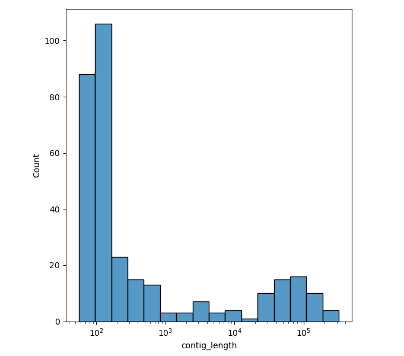  |                                  
| auto |average contig length: 15843.787301587301   total number of contigs: 315   shortest contig: 56    longest contig: 322089   N50 of all contigs: 147418   N50 of all contigs over 300 bp: 147418.0 |    |                                                                                     

#### statistics analysis for barcode: SRR1965341_trimmed 
|N50|
|---|  
|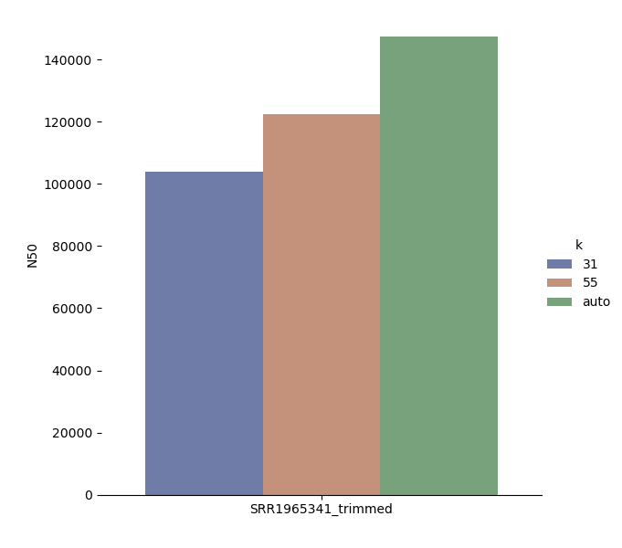|

| k  |statistics| plot   | 
|-------------------------|--------------------------|--------------------------|        
|31 |average contig length: 13960.842696629214   total number of contigs: 356   shortest contig: 32    longest contig: 321983   N50 of all contigs: 104010.0   N50 of all contigs over 300 bp: 104010.0| 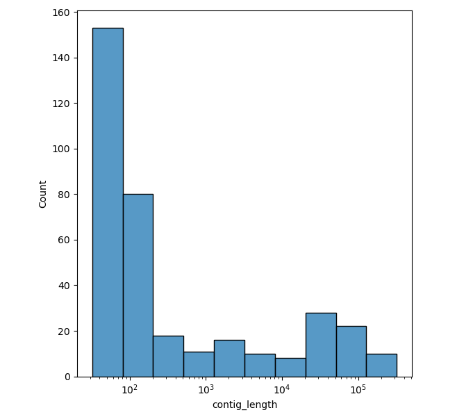 |
|55| average contig length: 28447.96   total number of contigs: 175   shortest contig: 56    longest contig: 322089   N50 of all contigs: 122401   N50 of all contigs over 300 bp: 122401.0 | 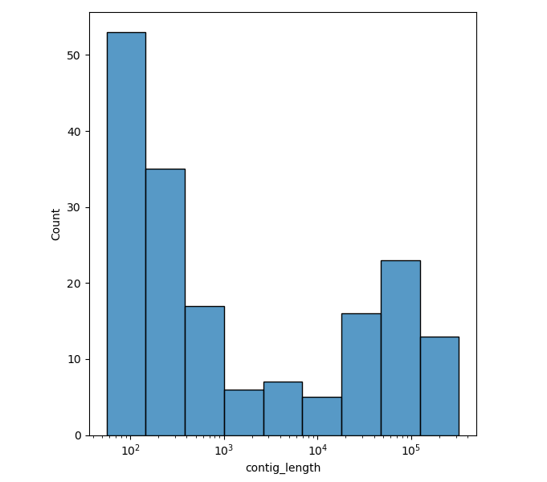  |                                  
| auto |average contig length: 28776.976878612717   total number of contigs: 173   shortest contig: 56    longest contig: 322089   N50 of all contigs: 147418   N50 of all contigs over 300 bp: 147418.0 |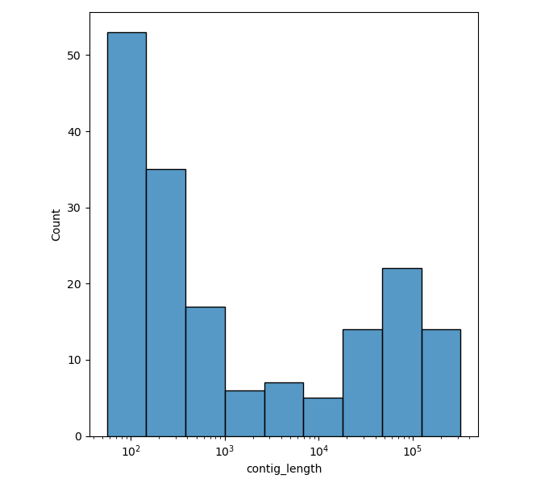    |                                                                                     

#### statistics analysis for barcode: SRR5584993_trimmed 
|N50|
|---|  
|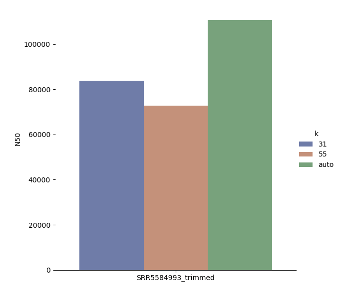|

| k  |statistics| plot   | 
|-------------------------|--------------------------|--------------------------|        
|31 |average contig length: 10143.616141732284   total number of contigs: 508   shortest contig: 32    longest contig: 214129   N50 of all contigs: 83784   N50 of all contigs over 300 bp: 90443| 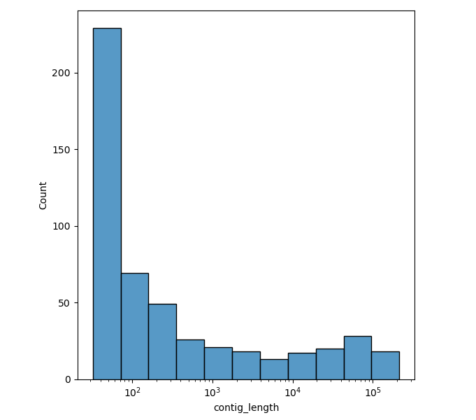 |
|55| average contig length: 15941.512345679012   total number of contigs: 324   shortest contig: 56    longest contig: 251418   N50 of all contigs: 72675.0   N50 of all contigs over 300 bp: 72675 |   |                                  
| auto |average contig length: 18783.214545454546   total number of contigs: 275   shortest contig: 56    longest contig: 345255   N50 of all contigs: 110752.0   N50 of all contigs over 300 bp: 110925 |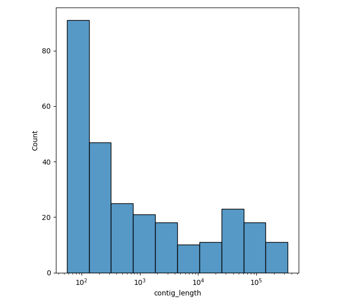    |                                                                                     

#### statistics analysis for barcode: SRR5584993_untrimmed 
|N50|
|---|  
|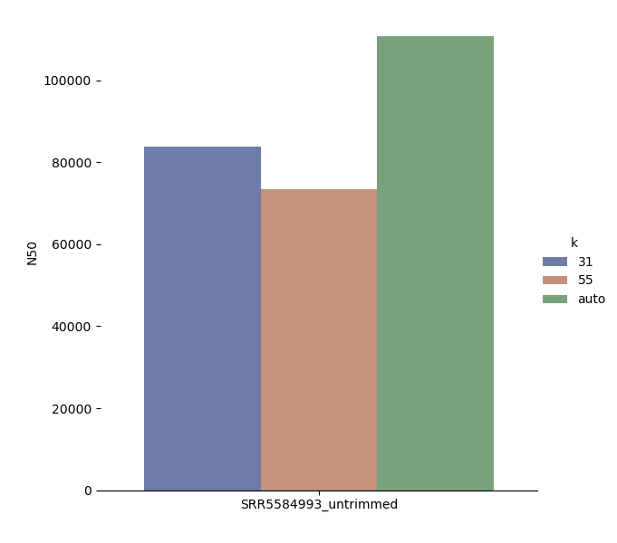|

| k  |statistics| plot   | 
|-------------------------|--------------------------|--------------------------|        
|31 |average contig length: 10143.620078740158   total number of contigs: 508   shortest contig: 32    longest contig: 214128   N50 of all contigs: 83784   N50 of all contigs over 300 bp: 90443|  |
|55| average contig length: 16090.289719626167   total number of contigs: 321   shortest contig: 56    longest contig: 251418   N50 of all contigs: 73507   N50 of all contigs over 300 bp: 73507.0 | 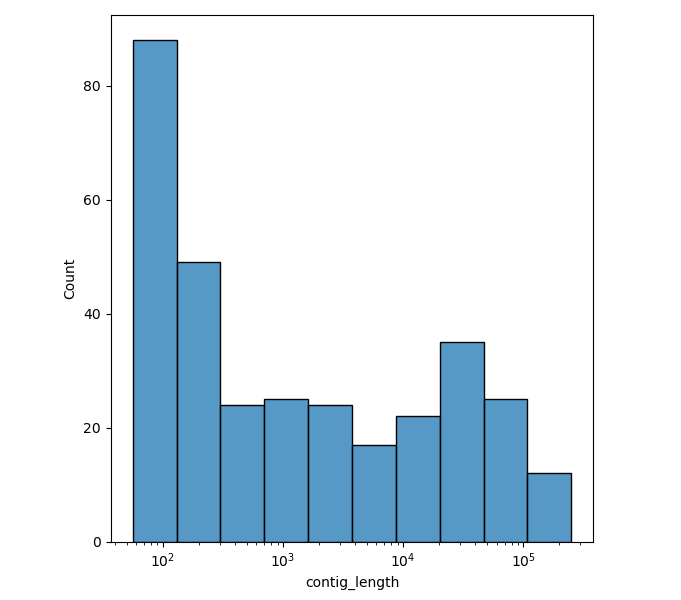  |                                  
| auto |average contig length: 18783.30181818182   total number of contigs: 275   shortest contig: 56    longest contig: 345255   N50 of all contigs: 110752.0   N50 of all contigs over 300 bp: 110925 |    |                                                                                     

#### statistics analysis for barcode: SRR7828287_untrimmed 
|N50|
|---|  
||

| k  |statistics| plot   | 
|-------------------------|--------------------------|--------------------------|        
|31 |average contig length: 10239.719587628866   total number of contigs: 485   shortest contig: 32    longest contig: 288956   N50 of all contigs: 105498.0   N50 of all contigs over 300 bp: 105498.0| 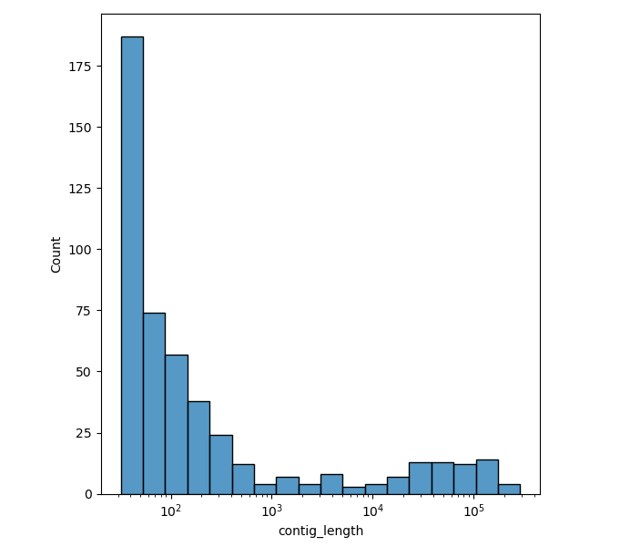 |
|55| average contig length: 29729.526946107784   total number of contigs: 167   shortest contig: 56    longest contig: 340335   N50 of all contigs: 156381   N50 of all contigs over 300 bp: 156381 | 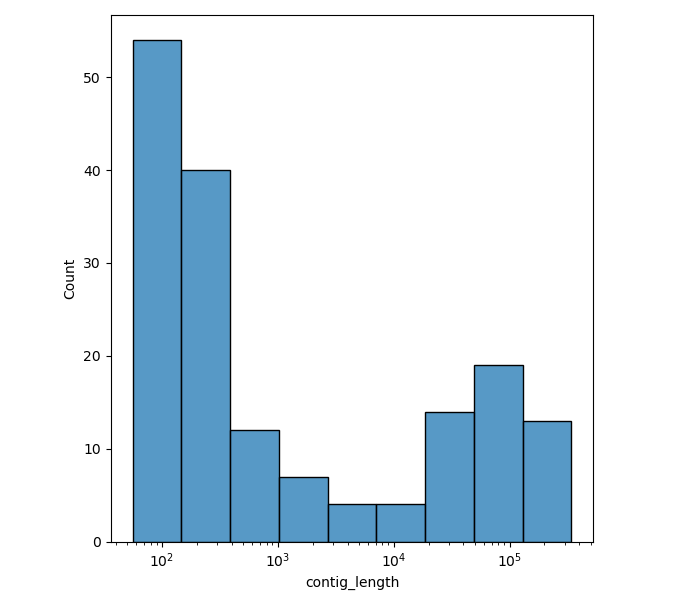  |                                  
| auto |average contig length: 25633.72680412371   total number of contigs: 194   shortest contig: 56    longest contig: 418725   N50 of all contigs: 156381   N50 of all contigs over 300 bp: 156381 |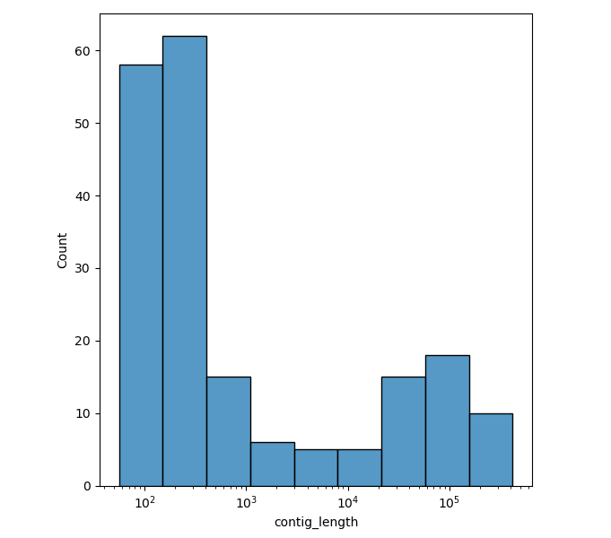    |                                                                                     

#### statistics analysis for barcode: SRR2075991_untrimmed 
|N50|
|---|  
|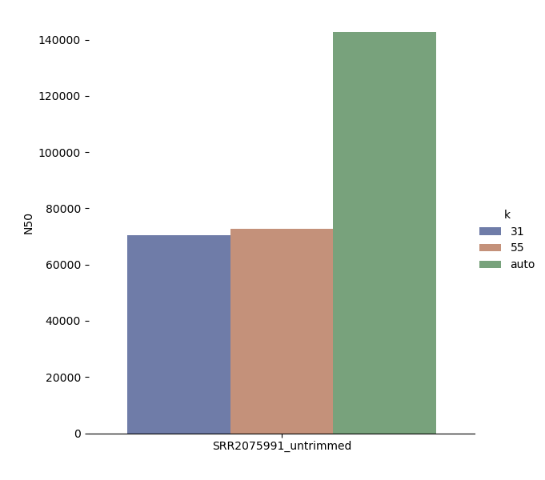|

| k  |statistics| plot   | 
|-------------------------|--------------------------|--------------------------|        
|31 |average contig length: 8259.847723704866   total number of contigs: 637   shortest contig: 32    longest contig: 201205   N50 of all contigs: 70389   N50 of all contigs over 300 bp: 70389.0| 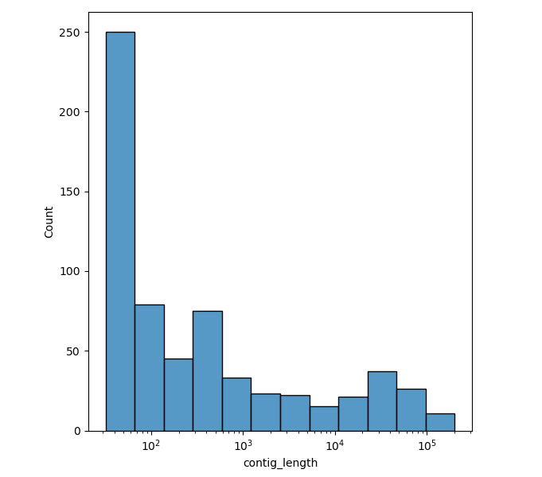 |
|55| average contig length: 16563.974842767297   total number of contigs: 318   shortest contig: 56    longest contig: 283747   N50 of all contigs: 72761.0   N50 of all contigs over 300 bp: 72761 | 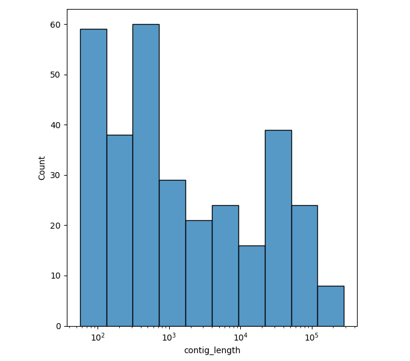  |                                  
| auto |average contig length: 28736.869565217392   total number of contigs: 184   shortest contig: 128    longest contig: 412932   N50 of all contigs: 142689.0   N50 of all contigs over 300 bp: 142689.0 |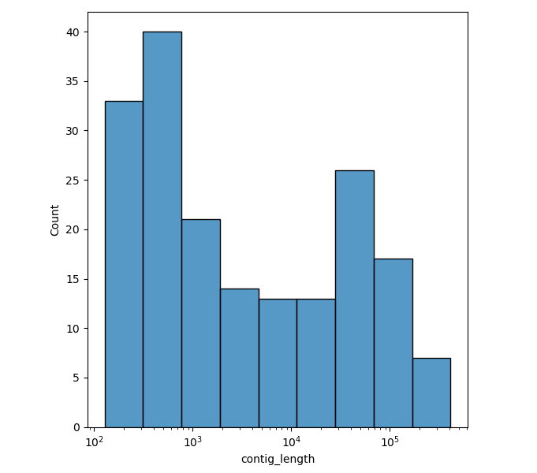    |                                                                                     

#### statistics analysis for barcode: SRR1968189_untrimmed 
|N50|
|---|  
||

| k  |statistics| plot   | 
|-------------------------|--------------------------|--------------------------|        
|31 |average contig length: 1430.5691744153282   total number of contigs: 3549   shortest contig: 32    longest contig: 109397   N50 of all contigs: 22741.0   N50 of all contigs over 300 bp: 23698.0| 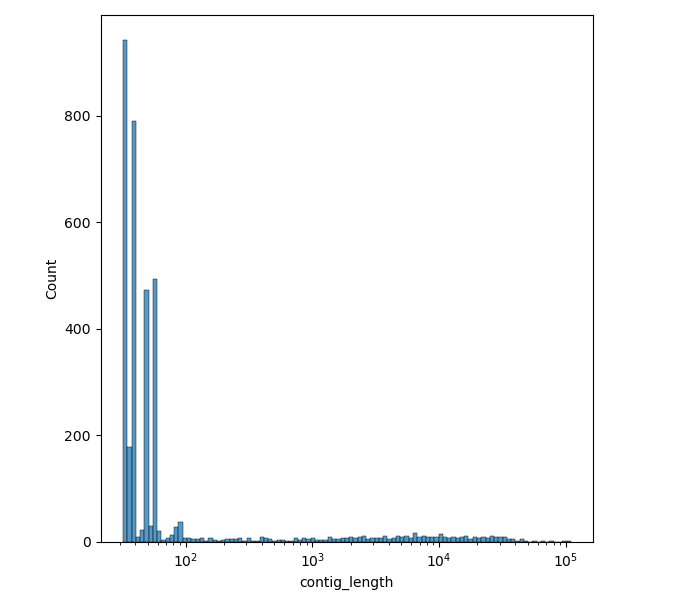 |
|55| average contig length: 11634.44730679157   total number of contigs: 427   shortest contig: 56    longest contig: 136577   N50 of all contigs: 48869   N50 of all contigs over 300 bp: 48869 | 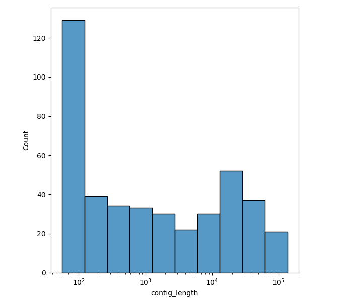  |                                  
| auto |average contig length: 15881.923322683706   total number of contigs: 313   shortest contig: 56    longest contig: 266385   N50 of all contigs: 93075.0   N50 of all contigs over 300 bp: 93075.0 |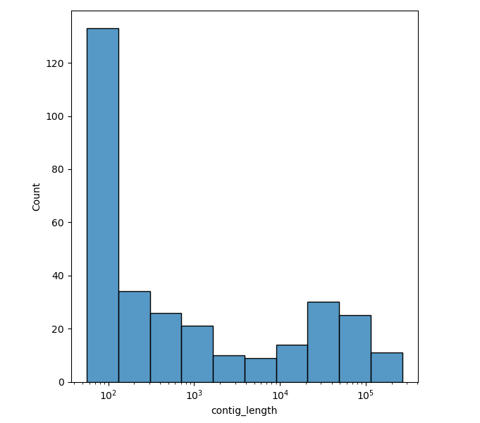    |                                                                                     

#### statistics analysis for barcode: SRR2075991_trimmed 
|N50|
|---|  
|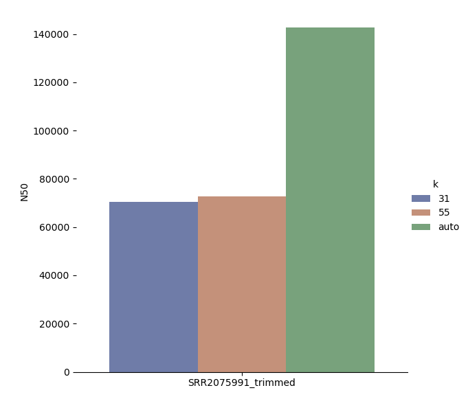|

| k  |statistics| plot   | 
|-------------------------|--------------------------|--------------------------|        
|31 |average contig length: 8540.056818181818   total number of contigs: 616   shortest contig: 32    longest contig: 201205   N50 of all contigs: 70389   N50 of all contigs over 300 bp: 70389.0| 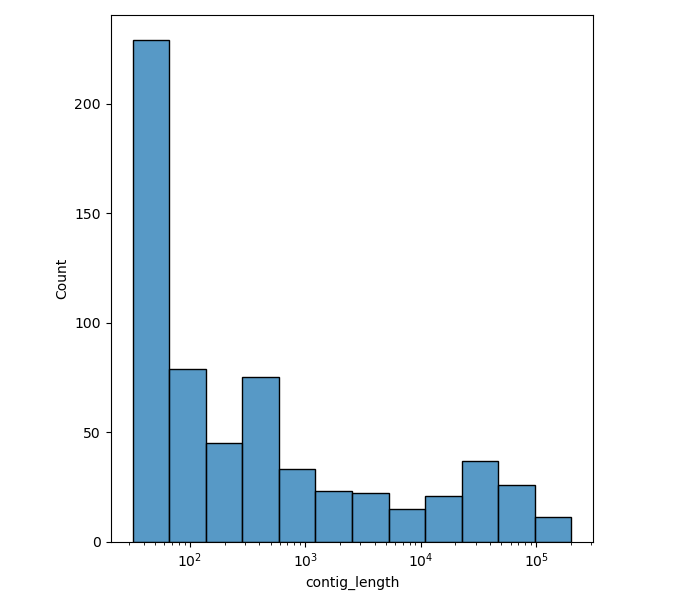 |
|55| average contig length: 16310.034055727554   total number of contigs: 323   shortest contig: 56    longest contig: 283747   N50 of all contigs: 72761   N50 of all contigs over 300 bp: 72761.0 | 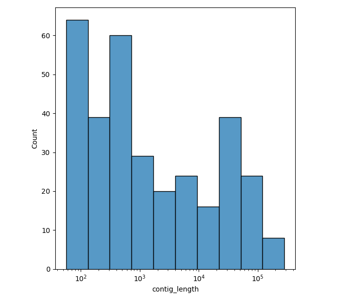  |                                  
| auto |average contig length: 28583.724324324325   total number of contigs: 185   shortest contig: 128    longest contig: 412929   N50 of all contigs: 142689   N50 of all contigs over 300 bp: 142689 |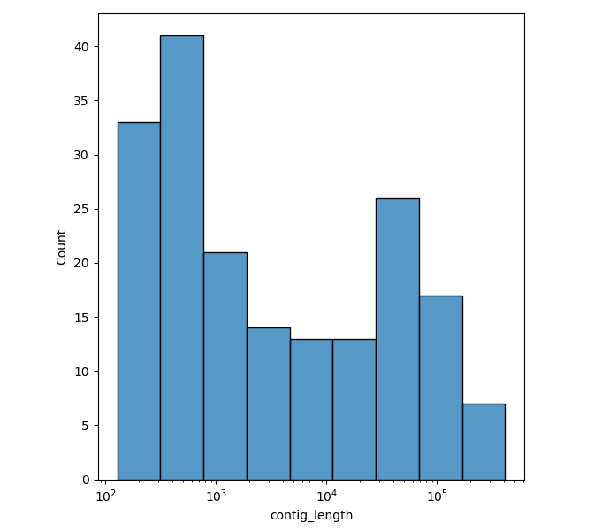    |                                                                                     

#### statistics analysis for barcode: SRR7828287_trimmed 
|N50|
|---|  
|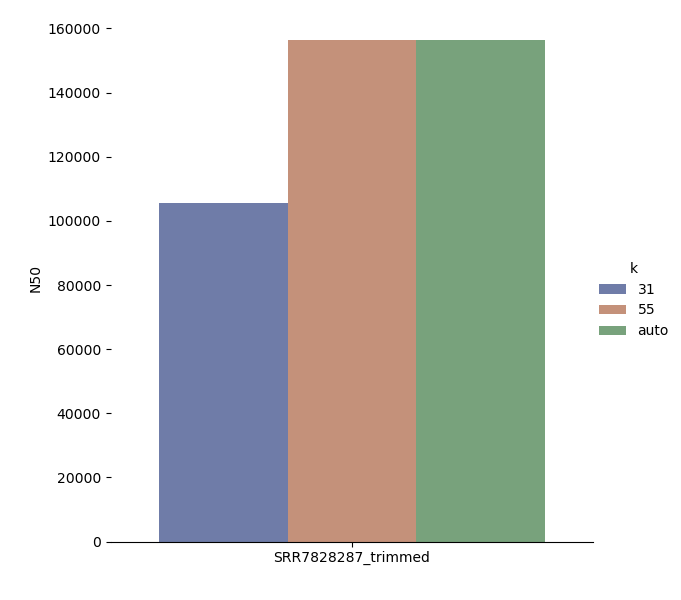|

| k  |statistics| plot   | 
|-------------------------|--------------------------|--------------------------|        
|31 |average contig length: 10239.38350515464   total number of contigs: 485   shortest contig: 32    longest contig: 288956   N50 of all contigs: 105498   N50 of all contigs over 300 bp: 105498|  |
|55| average contig length: 29729.22754491018   total number of contigs: 167   shortest contig: 56    longest contig: 340335   N50 of all contigs: 156381   N50 of all contigs over 300 bp: 156381 |   |                                  
| auto |average contig length: 25765.108808290155   total number of contigs: 193   shortest contig: 56    longest contig: 418725   N50 of all contigs: 156381.0   N50 of all contigs over 300 bp: 156381.0 |    |                                                                                     

#### statistics analysis for barcode: SRR1968189_trimmed 
|N50|
|---|  
|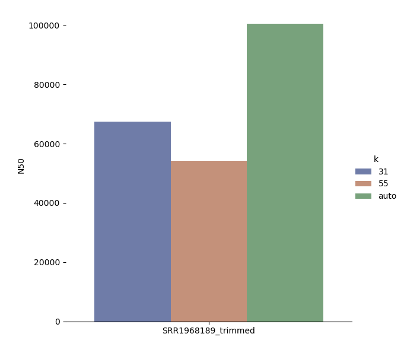|

| k  |statistics| plot   | 
|-------------------------|--------------------------|--------------------------|        
|31 |average contig length: 10473.215644820297   total number of contigs: 473   shortest contig: 32    longest contig: 157363   N50 of all contigs: 67403   N50 of all contigs over 300 bp: 67403| 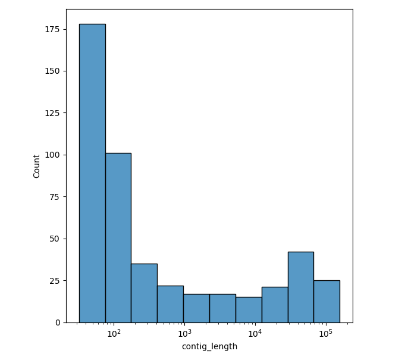 |
|55| average contig length: 17403.894736842107   total number of contigs: 285   shortest contig: 56    longest contig: 150850   N50 of all contigs: 54168.0   N50 of all contigs over 300 bp: 55820.0 | 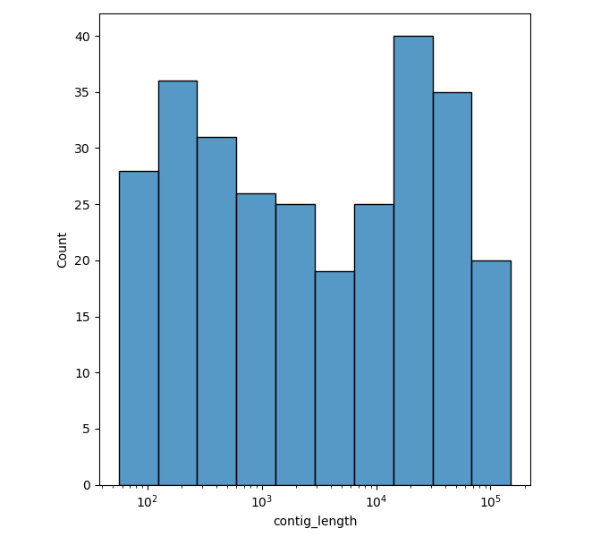  |                                  
| auto |average contig length: 25976.392670157067   total number of contigs: 191   shortest contig: 56    longest contig: 266422   N50 of all contigs: 100502   N50 of all contigs over 300 bp: 100502 |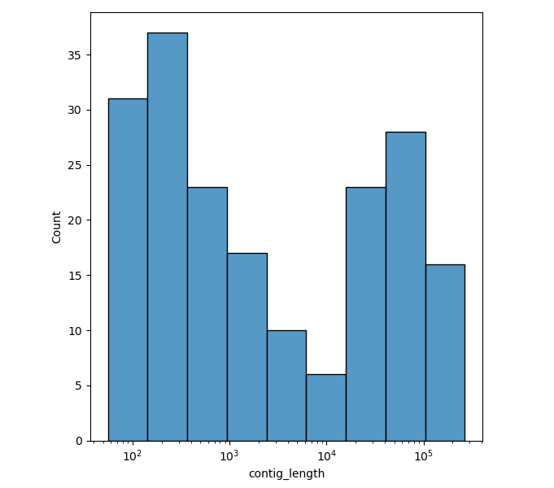    |                                                                                     

#### statistics analysis for barcode: barcode[0].barcode Nanopore long read assembled with miniasm 

| statistics| plot   | 
|-------------------------|--------------------------|        
|average contig length: 40438.74324324324 total number of contigs: 148  shortest contig: 3229 longest contig: 4870332 N50 of all contigs: 4870332.0 N50 of all contigs over 300 bp: 4870332.0| 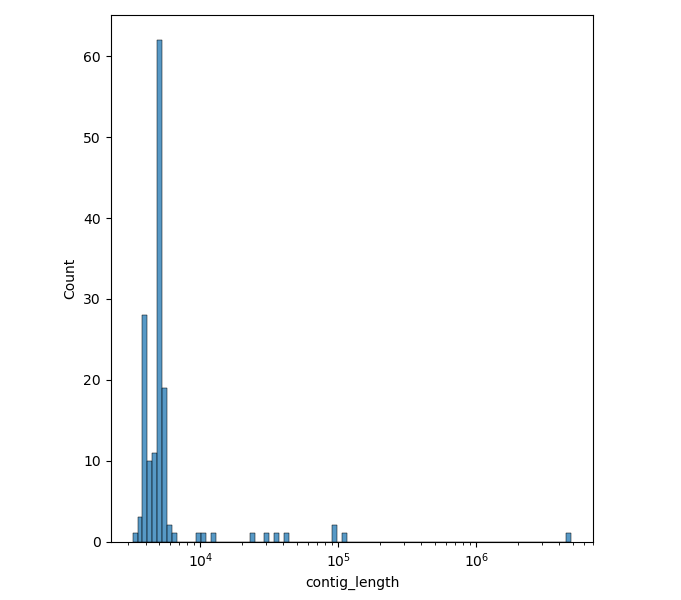 |