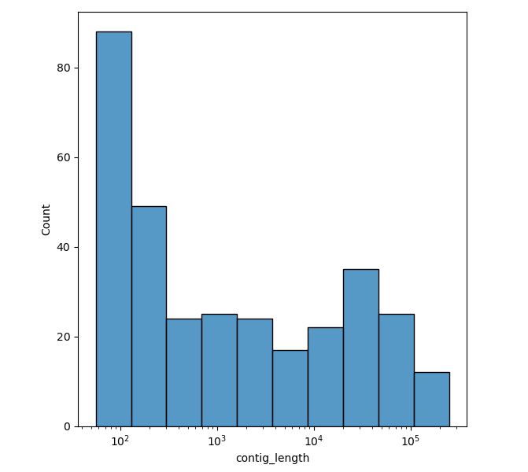

# statistics analysis for barcode: SRR2075991 assembled with SPAdes with parameter k = 55  
        average contig length: 16563.974842767297  
        total number of contigs: 318  
        shortest contig: 56  
        longest contig: 283747  
        N50 of all contigs: 72761.0  
        N50 of all contigs over 300 bp: 72761 
 
 
 # statistics analysis for barcode: SRR2075991 assembled with SPAdes with parameter k = auto  
        average contig length: 28736.869565217392  
        total number of contigs: 184  
        shortest contig: 128  
        longest contig: 412932  
        N50 of all contigs: 142689.0  
        N50 of all contigs over 300 bp: 142689.0 
 
 
 # statistics analysis for barcode: SRR7828287 assembled with SPAdes with parameter k = 31  
        average contig length: 10239.719587628866  
        total number of contigs: 485  
        shortest contig: 32  
        longest contig: 288956  
        N50 of all contigs: 105498.0  
        N50 of all contigs over 300 bp: 105498.0 
 
 
 # statistics analysis for barcode: SRR7828287 assembled with SPAdes with parameter k = 55  
        average contig length: 29729.526946107784  
        total number of contigs: 167  
        shortest contig: 56  
        longest contig: 340335  
        N50 of all contigs: 156381  
        N50 of all contigs over 300 bp: 156381 
 
 
 # statistics analysis for barcode: SRR7828287 assembled with SPAdes with parameter k = auto  
        average contig length: 25633.72680412371  
        total number of contigs: 194  
        shortest contig: 56  
        longest contig: 418725  
        N50 of all contigs: 156381  
        N50 of all contigs over 300 bp: 156381 
 
 
 # statistics analysis for barcode: SRR1965341 assembled with SPAdes with parameter k = 31  
        average contig length: 3363.1139410187666  
        total number of contigs: 1492  
        shortest contig: 32  
        longest contig: 321983  
        N50 of all contigs: 96827.0  
        N50 of all contigs over 300 bp: 103861 
 
 
 # statistics analysis for barcode: SRR1965341 assembled with SPAdes with parameter k = 55  
        average contig length: 15548.29906542056  
        total number of contigs: 321  
        shortest contig: 56  
        longest contig: 322089  
        N50 of all contigs: 110300.0  
        N50 of all contigs over 300 bp: 110300.0 
 
 
 # statistics analysis for barcode: SRR1965341 assembled with SPAdes with parameter k = auto  
        average contig length: 15843.787301587301  
        total number of contigs: 315  
        shortest contig: 56  
        longest contig: 322089  
        N50 of all contigs: 147418  
        N50 of all contigs over 300 bp: 147418.0 
 
 
 # statistics analysis for barcode: SRR5584993 assembled with SPAdes with parameter k = 31  
        average contig length: 10143.620078740158  
        total number of contigs: 508  
        shortest contig: 32  
        longest contig: 214128  
        N50 of all contigs: 83784  
        N50 of all contigs over 300 bp: 90443 
 
 
 # statistics analysis for barcode: SRR5584993 assembled with SPAdes with parameter k = 55  
        average contig length: 16090.289719626167  
        total number of contigs: 321  
        shortest contig: 56  
        longest contig: 251418  
        N50 of all contigs: 73507  
        N50 of all contigs over 300 bp: 73507.0 
 
 
 