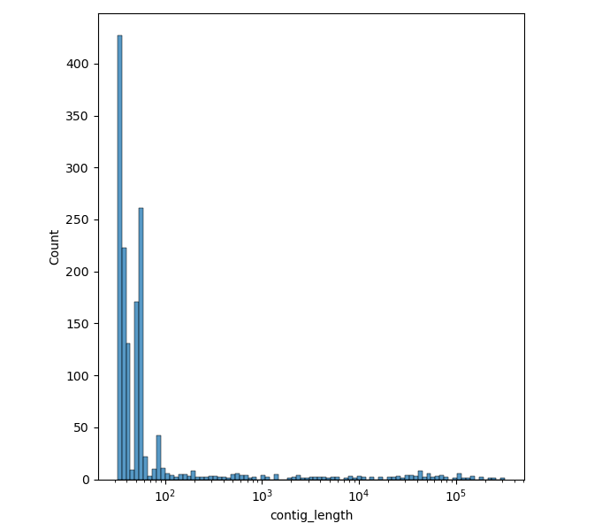
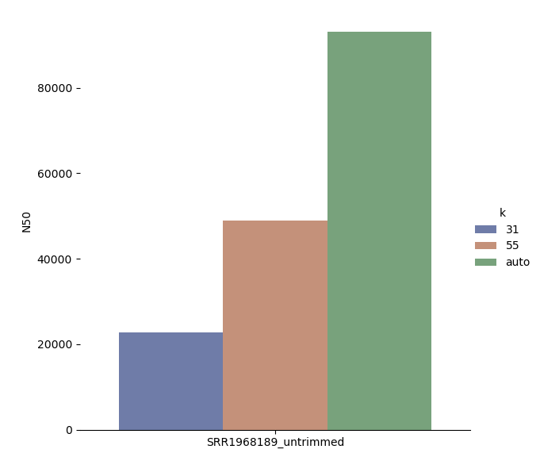

 

 
#### statistics analysis for barcode: SRR1965341_untrimmed           
|k = 31 | k = 55 | k = auto | 
|-------------------------|--------------------------|--------------------------|
|
|statistics analysis for barcode: SRR1965341_untrimmed assembled with SPAdes with parameter k = 31 | plot
| ------------------------------------------------------------------------------------------------------| --------------------------------------------
|average contig length: 3363.1139410187666                                                        |  
|total number of contigs: 1492                                                         | 
|shortest contig: 32                                                                 |
|longest contig: 321983                                                                   |
|N50 of all contigs: 96827.0                                                              |
|N50 of all contigs over 300 bp: 103861                                             |
                                              
       | 
|statistics analysis for barcode: SRR1965341_untrimmed assembled with SPAdes with parameter k = 31 | plot
| ------------------------------------------------------------------------------------------------------| --------------------------------------------
|average contig length: 3363.1139410187666                                                        |  
|total number of contigs: 1492                                                         | 
|shortest contig: 32                                                                 |
|longest contig: 321983                                                                   |
|N50 of all contigs: 96827.0                                                              |
|N50 of all contigs over 300 bp: 103861                                             |
                                              
       |
|statistics analysis for barcode: SRR1965341_untrimmed assembled with SPAdes with parameter k = 31 | plot
| ------------------------------------------------------------------------------------------------------| --------------------------------------------
|average contig length: 3363.1139410187666                                                        |  
|total number of contigs: 1492                                                         | 
|shortest contig: 32                                                                 |
|longest contig: 321983                                                                   |
|N50 of all contigs: 96827.0                                                              |
|N50 of all contigs over 300 bp: 103861                                             |
                                              
        |
|-------------------------|--------------------------|--------------------------|   
|       |           |                         |                                                            
 

 
#### statistics analysis for barcode: SRR1965341_trimmed           
|k = 31 | k = 55 | k = auto | 
|-------------------------|--------------------------|--------------------------|
|
|statistics analysis for barcode: SRR1965341_trimmed assembled with SPAdes with parameter k = 31 | plot
| ------------------------------------------------------------------------------------------------------| --------------------------------------------
|average contig length: 13960.842696629214                                                        |  
|total number of contigs: 356                                                         | 
|shortest contig: 32                                                                 |
|longest contig: 321983                                                                   |
|N50 of all contigs: 104010.0                                                              |
|N50 of all contigs over 300 bp: 104010.0                                             |
                                              
       | 
|statistics analysis for barcode: SRR1965341_trimmed assembled with SPAdes with parameter k = 31 | plot
| ------------------------------------------------------------------------------------------------------| --------------------------------------------
|average contig length: 13960.842696629214                                                        |  
|total number of contigs: 356                                                         | 
|shortest contig: 32                                                                 |
|longest contig: 321983                                                                   |
|N50 of all contigs: 104010.0                                                              |
|N50 of all contigs over 300 bp: 104010.0                                             |
                                              
       |
|statistics analysis for barcode: SRR1965341_trimmed assembled with SPAdes with parameter k = 31 | plot
| ------------------------------------------------------------------------------------------------------| --------------------------------------------
|average contig length: 13960.842696629214                                                        |  
|total number of contigs: 356                                                         | 
|shortest contig: 32                                                                 |
|longest contig: 321983                                                                   |
|N50 of all contigs: 104010.0                                                              |
|N50 of all contigs over 300 bp: 104010.0                                             |
                                              
        |
|-------------------------|--------------------------|--------------------------|   
|       |           |                         |                                                            
 

 
#### statistics analysis for barcode: SRR5584993_trimmed           
|k = 31 | k = 55 | k = auto | 
|-------------------------|--------------------------|--------------------------|
|
|statistics analysis for barcode: SRR5584993_trimmed assembled with SPAdes with parameter k = 31 | plot
| ------------------------------------------------------------------------------------------------------| --------------------------------------------
|average contig length: 10143.616141732284                                                        |  
|total number of contigs: 508                                                         | 
|shortest contig: 32                                                                 |
|longest contig: 214129                                                                   |
|N50 of all contigs: 83784                                                              |
|N50 of all contigs over 300 bp: 90443                                             |
                                              
       | 
|statistics analysis for barcode: SRR5584993_trimmed assembled with SPAdes with parameter k = 31 | plot
| ------------------------------------------------------------------------------------------------------| --------------------------------------------
|average contig length: 10143.616141732284                                                        |  
|total number of contigs: 508                                                         | 
|shortest contig: 32                                                                 |
|longest contig: 214129                                                                   |
|N50 of all contigs: 83784                                                              |
|N50 of all contigs over 300 bp: 90443                                             |
                                              
       |
|statistics analysis for barcode: SRR5584993_trimmed assembled with SPAdes with parameter k = 31 | plot
| ------------------------------------------------------------------------------------------------------| --------------------------------------------
|average contig length: 10143.616141732284                                                        |  
|total number of contigs: 508                                                         | 
|shortest contig: 32                                                                 |
|longest contig: 214129                                                                   |
|N50 of all contigs: 83784                                                              |
|N50 of all contigs over 300 bp: 90443                                             |
                                              
        |
|-------------------------|--------------------------|--------------------------|   
|       |           |                         |                                                            
 

 
#### statistics analysis for barcode: SRR5584993_untrimmed           
|k = 31 | k = 55 | k = auto | 
|-------------------------|--------------------------|--------------------------|
|
|statistics analysis for barcode: SRR5584993_untrimmed assembled with SPAdes with parameter k = 31 | plot
| ------------------------------------------------------------------------------------------------------| --------------------------------------------
|average contig length: 10143.620078740158                                                        |  
|total number of contigs: 508                                                         | 
|shortest contig: 32                                                                 |
|longest contig: 214128                                                                   |
|N50 of all contigs: 83784                                                              |
|N50 of all contigs over 300 bp: 90443                                             |
                                              
       | 
|statistics analysis for barcode: SRR5584993_untrimmed assembled with SPAdes with parameter k = 31 | plot
| ------------------------------------------------------------------------------------------------------| --------------------------------------------
|average contig length: 10143.620078740158                                                        |  
|total number of contigs: 508                                                         | 
|shortest contig: 32                                                                 |
|longest contig: 214128                                                                   |
|N50 of all contigs: 83784                                                              |
|N50 of all contigs over 300 bp: 90443                                             |
                                              
       |
|statistics analysis for barcode: SRR5584993_untrimmed assembled with SPAdes with parameter k = 31 | plot
| ------------------------------------------------------------------------------------------------------| --------------------------------------------
|average contig length: 10143.620078740158                                                        |  
|total number of contigs: 508                                                         | 
|shortest contig: 32                                                                 |
|longest contig: 214128                                                                   |
|N50 of all contigs: 83784                                                              |
|N50 of all contigs over 300 bp: 90443                                             |
                                              
        |
|-------------------------|--------------------------|--------------------------|   
|       |           |                         |                                                            
 

 
#### statistics analysis for barcode: SRR7828287_untrimmed           
|k = 31 | k = 55 | k = auto | 
|-------------------------|--------------------------|--------------------------|
|
|statistics analysis for barcode: SRR7828287_untrimmed assembled with SPAdes with parameter k = 31 | plot
| ------------------------------------------------------------------------------------------------------| --------------------------------------------
|average contig length: 10239.719587628866                                                        |  
|total number of contigs: 485                                                         | 
|shortest contig: 32                                                                 |
|longest contig: 288956                                                                   |
|N50 of all contigs: 105498.0                                                              |
|N50 of all contigs over 300 bp: 105498.0                                             |
                                              
       | 
|statistics analysis for barcode: SRR7828287_untrimmed assembled with SPAdes with parameter k = 31 | plot
| ------------------------------------------------------------------------------------------------------| --------------------------------------------
|average contig length: 10239.719587628866                                                        |  
|total number of contigs: 485                                                         | 
|shortest contig: 32                                                                 |
|longest contig: 288956                                                                   |
|N50 of all contigs: 105498.0                                                              |
|N50 of all contigs over 300 bp: 105498.0                                             |
                                              
       |
|statistics analysis for barcode: SRR7828287_untrimmed assembled with SPAdes with parameter k = 31 | plot
| ------------------------------------------------------------------------------------------------------| --------------------------------------------
|average contig length: 10239.719587628866                                                        |  
|total number of contigs: 485                                                         | 
|shortest contig: 32                                                                 |
|longest contig: 288956                                                                   |
|N50 of all contigs: 105498.0                                                              |
|N50 of all contigs over 300 bp: 105498.0                                             |
                                              
        |
|-------------------------|--------------------------|--------------------------|   
|       |           |                         |                                                            
 

 
#### statistics analysis for barcode: SRR2075991_untrimmed           
|k = 31 | k = 55 | k = auto | 
|-------------------------|--------------------------|--------------------------|
|
|statistics analysis for barcode: SRR2075991_untrimmed assembled with SPAdes with parameter k = 31 | plot
| ------------------------------------------------------------------------------------------------------| --------------------------------------------
|average contig length: 8259.847723704866                                                        |  
|total number of contigs: 637                                                         | 
|shortest contig: 32                                                                 |
|longest contig: 201205                                                                   |
|N50 of all contigs: 70389                                                              |
|N50 of all contigs over 300 bp: 70389.0                                             |
                                              
       | 
|statistics analysis for barcode: SRR2075991_untrimmed assembled with SPAdes with parameter k = 31 | plot
| ------------------------------------------------------------------------------------------------------| --------------------------------------------
|average contig length: 8259.847723704866                                                        |  
|total number of contigs: 637                                                         | 
|shortest contig: 32                                                                 |
|longest contig: 201205                                                                   |
|N50 of all contigs: 70389                                                              |
|N50 of all contigs over 300 bp: 70389.0                                             |
                                              
       |
|statistics analysis for barcode: SRR2075991_untrimmed assembled with SPAdes with parameter k = 31 | plot
| ------------------------------------------------------------------------------------------------------| --------------------------------------------
|average contig length: 8259.847723704866                                                        |  
|total number of contigs: 637                                                         | 
|shortest contig: 32                                                                 |
|longest contig: 201205                                                                   |
|N50 of all contigs: 70389                                                              |
|N50 of all contigs over 300 bp: 70389.0                                             |
                                              
        |
|-------------------------|--------------------------|--------------------------|   
|       |           |                         |                                                            
 

 
#### statistics analysis for barcode: SRR1968189_untrimmed           
|k = 31 | k = 55 | k = auto | 
|-------------------------|--------------------------|--------------------------|
|
|statistics analysis for barcode: SRR1968189_untrimmed assembled with SPAdes with parameter k = 31 | plot
| ------------------------------------------------------------------------------------------------------| --------------------------------------------
|average contig length: 1430.5691744153282                                                        |  
|total number of contigs: 3549                                                         | 
|shortest contig: 32                                                                 |
|longest contig: 109397                                                                   |
|N50 of all contigs: 22741.0                                                              |
|N50 of all contigs over 300 bp: 23698.0                                             |
                                              
       | 
|statistics analysis for barcode: SRR1968189_untrimmed assembled with SPAdes with parameter k = 31 | plot
| ------------------------------------------------------------------------------------------------------| --------------------------------------------
|average contig length: 1430.5691744153282                                                        |  
|total number of contigs: 3549                                                         | 
|shortest contig: 32                                                                 |
|longest contig: 109397                                                                   |
|N50 of all contigs: 22741.0                                                              |
|N50 of all contigs over 300 bp: 23698.0                                             |
                                              
       |
|statistics analysis for barcode: SRR1968189_untrimmed assembled with SPAdes with parameter k = 31 | plot
| ------------------------------------------------------------------------------------------------------| --------------------------------------------
|average contig length: 1430.5691744153282                                                        |  
|total number of contigs: 3549                                                         | 
|shortest contig: 32                                                                 |
|longest contig: 109397                                                                   |
|N50 of all contigs: 22741.0                                                              |
|N50 of all contigs over 300 bp: 23698.0                                             |
                                              
        |
|-------------------------|--------------------------|--------------------------|   
|       |           |                         |                                                            
 

 
#### statistics analysis for barcode: SRR2075991_trimmed           
|k = 31 | k = 55 | k = auto | 
|-------------------------|--------------------------|--------------------------|
|
|statistics analysis for barcode: SRR2075991_trimmed assembled with SPAdes with parameter k = 31 | plot
| ------------------------------------------------------------------------------------------------------| --------------------------------------------
|average contig length: 8540.056818181818                                                        |  
|total number of contigs: 616                                                         | 
|shortest contig: 32                                                                 |
|longest contig: 201205                                                                   |
|N50 of all contigs: 70389                                                              |
|N50 of all contigs over 300 bp: 70389.0                                             |
                                              
       | 
|statistics analysis for barcode: SRR2075991_trimmed assembled with SPAdes with parameter k = 31 | plot
| ------------------------------------------------------------------------------------------------------| --------------------------------------------
|average contig length: 8540.056818181818                                                        |  
|total number of contigs: 616                                                         | 
|shortest contig: 32                                                                 |
|longest contig: 201205                                                                   |
|N50 of all contigs: 70389                                                              |
|N50 of all contigs over 300 bp: 70389.0                                             |
                                              
       |
|statistics analysis for barcode: SRR2075991_trimmed assembled with SPAdes with parameter k = 31 | plot
| ------------------------------------------------------------------------------------------------------| --------------------------------------------
|average contig length: 8540.056818181818                                                        |  
|total number of contigs: 616                                                         | 
|shortest contig: 32                                                                 |
|longest contig: 201205                                                                   |
|N50 of all contigs: 70389                                                              |
|N50 of all contigs over 300 bp: 70389.0                                             |
                                              
        |
|-------------------------|--------------------------|--------------------------|   
|       |           |                         |                                                            
 

 
#### statistics analysis for barcode: SRR7828287_trimmed           
|k = 31 | k = 55 | k = auto | 
|-------------------------|--------------------------|--------------------------|
|
|statistics analysis for barcode: SRR7828287_trimmed assembled with SPAdes with parameter k = 31 | plot
| ------------------------------------------------------------------------------------------------------| --------------------------------------------
|average contig length: 10239.38350515464                                                        |  
|total number of contigs: 485                                                         | 
|shortest contig: 32                                                                 |
|longest contig: 288956                                                                   |
|N50 of all contigs: 105498                                                              |
|N50 of all contigs over 300 bp: 105498                                             |
                                              
       | 
|statistics analysis for barcode: SRR7828287_trimmed assembled with SPAdes with parameter k = 31 | plot
| ------------------------------------------------------------------------------------------------------| --------------------------------------------
|average contig length: 10239.38350515464                                                        |  
|total number of contigs: 485                                                         | 
|shortest contig: 32                                                                 |
|longest contig: 288956                                                                   |
|N50 of all contigs: 105498                                                              |
|N50 of all contigs over 300 bp: 105498                                             |
                                              
       |
|statistics analysis for barcode: SRR7828287_trimmed assembled with SPAdes with parameter k = 31 | plot
| ------------------------------------------------------------------------------------------------------| --------------------------------------------
|average contig length: 10239.38350515464                                                        |  
|total number of contigs: 485                                                         | 
|shortest contig: 32                                                                 |
|longest contig: 288956                                                                   |
|N50 of all contigs: 105498                                                              |
|N50 of all contigs over 300 bp: 105498                                             |
                                              
        |
|-------------------------|--------------------------|--------------------------|   
|       |           |                         |                                                            
 

 
#### statistics analysis for barcode: SRR1968189_trimmed           
|k = 31 | k = 55 | k = auto | 
|-------------------------|--------------------------|--------------------------|
|
|statistics analysis for barcode: SRR1968189_trimmed assembled with SPAdes with parameter k = 31 | plot
| ------------------------------------------------------------------------------------------------------| --------------------------------------------
|average contig length: 10473.215644820297                                                        |  
|total number of contigs: 473                                                         | 
|shortest contig: 32                                                                 |
|longest contig: 157363                                                                   |
|N50 of all contigs: 67403                                                              |
|N50 of all contigs over 300 bp: 67403                                             |
                                              
       | 
|statistics analysis for barcode: SRR1968189_trimmed assembled with SPAdes with parameter k = 31 | plot
| ------------------------------------------------------------------------------------------------------| --------------------------------------------
|average contig length: 10473.215644820297                                                        |  
|total number of contigs: 473                                                         | 
|shortest contig: 32                                                                 |
|longest contig: 157363                                                                   |
|N50 of all contigs: 67403                                                              |
|N50 of all contigs over 300 bp: 67403                                             |
                                              
       |
|statistics analysis for barcode: SRR1968189_trimmed assembled with SPAdes with parameter k = 31 | plot
| ------------------------------------------------------------------------------------------------------| --------------------------------------------
|average contig length: 10473.215644820297                                                        |  
|total number of contigs: 473                                                         | 
|shortest contig: 32                                                                 |
|longest contig: 157363                                                                   |
|N50 of all contigs: 67403                                                              |
|N50 of all contigs over 300 bp: 67403                                             |
                                              
        |
|-------------------------|--------------------------|--------------------------|   
|       |           |                         |                                                            

|statistics analysis for barcode: SRR8902592 Nanopore long read assembled with miniasm | plot
| ------------------------------------------------------------------------------------------------------| --------------------------------------------
|average contig length: 40438.74324324324                                                        | 
|total number of contigs: 148                                                         | 
|shortest contig: 3229                                                                 |
|longest contig: 4870332                                                                   |
|N50 of all contigs: 4870332.0                                                              |
|N50 of all contigs over 300 bp: 4870332.0                                             |
                                              
